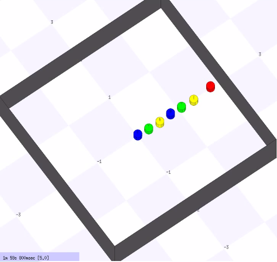
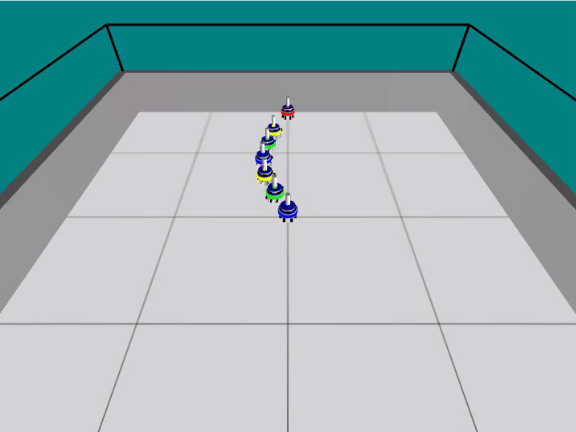

# swarm-sim

This is a meta package directing to simulation by different types of simulators: Stage and ARGoS.




Both versions perform the same simulation task. Multiple robots collaborate to construct a chain from the root robot to the destination.

To clone both repositories at once. Run the following commands after you clone this repository,
```
cd swarm-sim
git submodule init
git submodule update
```

Or you can clone all of them by cloning this repository with `--recurse-submodules` option,
```
git clone --recurse-submodules git@github.com:tidota/swarm-sim.git
```


For more details, please refer to the following repositories.

- [Swarm simulation by Stage](https://github.com/tidota/swarm-stage)

- [Swarm simulation by ARGoS](https://github.com/tidota/swarm-argos)

